# EnterpriseClaw

EnterpriseClaw is a production-oriented agent orchestration framework built on LangGraph.
It separates decision-making (Supervisor) from execution (Worker), adds human approval for risky actions, and keeps durable memory in SQLite + vector indexes.

This repository contains everything needed to run the assistant locally through Telegram, a web endpoint, or CLI.

## At a glance

- Deterministic Supervisor/Worker graph architecture.
- Tiered Human-In-The-Loop (HITL) safety for tool execution.
- Persistent state via SQLite checkpointing.
- Long-term memory via SQLite + Zvec vector retrieval.
- Dynamic tool plugin loading from `mcp_servers/`.
- Dynamic skill retrieval from `skills/`.
- Browser automation with Playwright and per-thread sessions.
- Optional Google Workspace (Gmail/Calendar) tool integration.

## What this repo includes

### Core runtime

- `app.py`: FastAPI entrypoint, Telegram polling/webhook handling, graph lifecycle.
- `config/settings.py`: environment configuration.
- `core/graphs/`: LangGraph Supervisor and Worker graph definitions.
- `core/nodes/`: prompt building, executor, tool nodes, compaction, error handling.
- `core/hitl.py`: tool approval tier rules.
- `core/channel_manager.py`: routes responses/approvals to platform adapters.

### Interfaces

- `interfaces/telegram.py`: Telegram adapter (messages + approval buttons).
- `interfaces/web_chat.py`: web UI route and web adapter scaffold.
- `interfaces/cli.py`: terminal adapter.
- `templates/chat.html`, `static/css/chat.css`, `static/js/chat.js`: web chat frontend.

### Tool system

- `mcp_servers/__init__.py`: dynamic plugin loader + global tool registry.
- `mcp_servers/core_tools.py`: delegation, reminders, memory save, batching.
- `mcp_servers/web_tools.py`: web search/fetch.
- `mcp_servers/browser_tools.py`: Playwright browser automation tools.
- `mcp_servers/exec_tools.py`: shell command execution.
- `mcp_servers/google_workspace.py`: Gmail/Calendar tools.

### Memory

- `memory/db.py`: SQLite storage for conversation history + durable memory items.
- `memory/vectorstore.py`: Zvec + FastEmbed indexing/retrieval + skill indexing.
- `memory/retrieval.py`: high-level memory retrieval service.

### Skills

- `skills/identity/skill.md`: base assistant identity prompt.
- `skills/*/skill.md`: task-specific behavior modules used by Worker JIT retrieval.

### Setup and scripts

- `scripts/onboarding.py`: setup wizard (web and CLI modes).
- `scripts/google_auth_helper.py`: OAuth helper for Google Workspace tools.

### Tests

- `tests/`: browser tools, memory system, worker architecture, tool behavior, zvec checks.

## Architecture diagram

```mermaid
flowchart LR
    %% ===== Clean Minimalist Styling =====
    classDef client fill:#FFFFFF,stroke:#333333,stroke-width:2px,color:#000000,rx:10,ry:10
    classDef gateway fill:#E9F4FF,stroke:#2D6EA8,stroke-width:2px,color:#11324D,rx:10,ry:10
    classDef supervisor fill:#EAF9EF,stroke:#2D8A57,stroke-width:2px,color:#0F3F25,rx:10,ry:10
    classDef worker fill:#F3E5F5,stroke:#4A148C,stroke-width:2px,color:#311B92,rx:10,ry:10
    classDef tools fill:#FFF0E3,stroke:#C25A00,stroke-width:2px,color:#4A2200,rx:10,ry:10
    classDef memory fill:#FCEEF2,stroke:#B23A5A,stroke-width:2px,color:#4A1120,rx:10,ry:10

    %% ===== Nodes =====
    C(["📱 Clients 
    (Telegram, Web, CLI)"]):::client
    G(["🌐 API Gateway
    (FastAPI & Channels)"]):::gateway
    S(["🧠 Supervisor
    (Persistent Orchestrator)"]):::supervisor
    W(["⚡ Worker
    (Ephemeral Executor)"]):::worker
    T(["🛠️ Tool Runtime
    (& HITL Gate)"]):::tools 
    M(["📚 Memory & Skills
    (Vector + SQLite)"]):::memory

    %% ===== Main User Flow (Thick Lines) =====
    C <==> G
    G <==>|"Chat Flow"| S
    S ==>|"delegate_task(domain)"| W
    W ==>|"result_summary"| S

    %% ===== Execution Loop =====
    W <==>|"Action / Observation"| T
    
    %% ===== Secondary/Background Flows (Dotted Lines) =====
    T -.->|"HITL Approval Request"| G
    S -.->|"Fetch Context"| M
    W -.->|"Fetch Domain Rules"| M
```



### Simple flow (text)

```text
User (Telegram/Web/CLI)
  -> app.py entrypoints
  -> Supervisor graph (intent, prompt, response)
       -> direct answer OR delegate_task(...)
  -> Worker graph (objective loop with scoped tools)
       -> tools execute with HITL checks
  -> final response
  -> ChannelManager routes back to interface
```

Key design idea: the Supervisor handles conversation and memory context, while the Worker handles multi-step execution with stricter scope and loop controls.

## Safety model (HITL)

Tools are split into three tiers in `core/hitl.py`:

1. `autonomous`: always run without approval.
2. `allowed`: auto-approved by default, can be locked with `/deny`.
3. `not_allowed`: requires approval unless explicitly `/permit`-ed.

Examples:

- Autonomous: `web_search`, `web_fetch`, `browser_get_text`, `browser_snapshot`.
- Allowed by default: `delegate_task`, `browser_navigate`.
- Approval-gated: `browser_click`, `browser_type`, `browser_file_upload`, `exec_command`, `batch_actions`.

## Delegation contract

The Supervisor delegates complex work using:

```python
delegate_task(
    objective="Clear task description",
    domain="browser",   # one of: browser, exec, all
    max_steps=15,
)
```

- `domain=browser`: browser-category tools.
- `domain=exec`: command execution tools.
- `domain=all`: all loaded categories.

Worker safeguards:

- hard step limit,
- escalation path via `escalate_to_supervisor`,
- stateful tools executed sequentially,
- heavy environment observation replaced each turn (prevents prompt bloat).

## Quick start

### 1. Prerequisites

- Python 3.12+
- `uv` package manager
- Chrome/Chromium available for browser tools
- API keys (at minimum Google + Telegram for default startup gate)

### 2. Install dependencies

```bash
git clone https://github.com/chetanreddyv/EnterpriseClaw.git
cd EnterpriseClaw
uv sync
uv run playwright install chromium
```

### 3. Configure environment

Recommended (wizard):

```bash
uv run python scripts/onboarding.py
```

CLI fallback:

```bash
uv run python scripts/onboarding.py --cli
```

Manual setup:

```bash
cp .env.example .env
```

Minimum keys to pass startup checks in current code:

- `GOOGLE_API_KEY`
- `TELEGRAM_BOT_TOKEN`

Common optional keys:

- `OPENAI_API_KEY`
- `LM_STUDIO_BASE_URL` (default local OpenAI-compatible endpoint)
- `LM_STUDIO_API_KEY`
- `GOOGLE_TOKEN_JSON` (base64 token for Google Workspace APIs)
- `ALLOWED_CHAT_IDS`
- `TELEGRAM_SECRET_TOKEN`

### 4. Optional: Google Workspace auth

If you want Gmail/Calendar tools:

```bash
uv run python scripts/google_auth_helper.py
```

Then either keep `token.json` in `scripts/` for local use, or base64-encode it into `GOOGLE_TOKEN_JSON` for deployed environments.

### 5. Run

API server:

```bash
uv run python app.py
```

CLI mode:

```bash
uv run python app.py --cli
```

Health check:

```bash
curl http://127.0.0.1:8000/health
```

## Model switching

Per-thread model hot swap is supported with `/model`:

```text
/model lmstudio/qwen/qwen3.5
/model openai/gpt-4o
/model google_genai/gemini-2.5-flash
/model anthropic/claude-3-5-sonnet-20241022
```

Useful commands:

- `/models`: list configured providers.
- `/permit <tool_name>`: allow a normally gated tool for this thread.
- `/deny <tool_name>`: force approval for an auto-allowed tool.
- `/tools`: show tool policy state for this thread.

## API surface

Main endpoints in `app.py`:

- `GET /health`
- `POST /webhook` (Telegram webhook)
- `POST /api/v1/chat/{thread_id}`
- `POST /api/v1/chat/{thread_id}/resume`
- `POST /api/v1/system/{thread_id}/notify`
- `GET /chat` (web chat page)

Example chat call:

```bash
curl -X POST http://127.0.0.1:8000/api/v1/chat/demo-thread \
  -H "Content-Type: application/json" \
  -d '{"user_input":"Summarize the latest AI headlines"}'
```

## Tool categories and plugins

Tool plugins are loaded automatically from every Python module in `mcp_servers/` that exposes `TOOL_REGISTRY`.

Category names are derived from file names:

- `browser_tools.py` -> `browser`
- `exec_tools.py` -> `exec`
- `web_tools.py` -> `web`
- `google_workspace.py` -> `google_workspace`
- `core_tools.py` -> `core`

To add a new tool family:

1. Create `mcp_servers/<name>_tools.py`.
2. Export `TOOL_REGISTRY = {"tool_name": callable, ...}`.
3. Restart the app.
4. (Optional) create/update a matching `skills/<skill>/skill.md` with `tools:` frontmatter.

## Memory architecture

- Conversation history and durable memory items are stored in SQLite.
- Semantic retrieval uses Zvec + FastEmbed embeddings.
- Skill embeddings are rebuilt at startup from `skills/`.

Important persisted artifacts under `data/`:

- `checkpoints_v2.db`: LangGraph checkpoint state.
- `agent_session.db`: history + memory items.
- `zvec_index/`: long-term memory vector index.
- `zvec_skills/`: skill vector index.
- `screenshots/`: browser tool screenshot output.
- `browser_profile/`: persistent browser session/profile data.
- `reminders.json`: scheduled reminder data.

## Docker deployment

Build and run:

```bash
docker compose up --build
```

Notes:

- App listens on port `8000`.
- `./data` is mounted into the container for persistence.
- Healthcheck uses `/health`.

## Testing

Run all tests:

```bash
uv run pytest
```

Run focused suites:

```bash
uv run pytest tests/test_dynamic_worker_architecture.py -q
uv run pytest tests/test_memory_system.py -q
```

Browser tests require Playwright + browser runtime and may need network access.

## Known limitations

- Web adapter in `interfaces/web_chat.py` is currently a scaffold (`send_message`/`request_approval` are placeholders), so Telegram and CLI are the most complete interfaces.
- Startup onboarding gate currently expects both `GOOGLE_API_KEY` and `TELEGRAM_BOT_TOKEN` to be non-empty.
- `skills/cron/skill.md` references cron tools (`cron_add`, `cron_list`, `cron_remove`) that are not currently provided in `mcp_servers/` in this repo snapshot.

## Contribution guide

When adding features:

1. Keep tool schemas explicit and strict.
2. Keep risky actions behind HITL checks.
3. Add or update tests in `tests/`.
4. Document new tools/skills in this README.

## License

MIT. See `LICENSE`.
